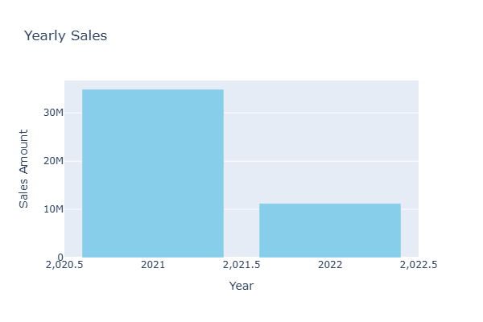
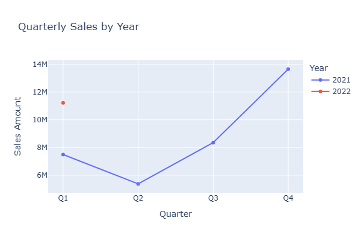
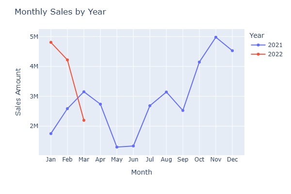

# Sales Analysis(2 Year Report)
## Problem Statement
- This project explores sales data over two years to answer business-critical questions such as:
1. What is the total sales amount?
2. How do sales vary by year, quarter, and month?
3. Which regions, countries, teams, and individuals perform best?
4. Which product categories and types drive the most sales?

## Why This Analysis Matters
- This sales analysis provides valuable insights into business performance over a two-year period. By breaking down total sales by time (monthly, quarterly, yearly) and across different business dimensions (region, country, team,category, product type, and salesperson), the analysis helps identify trends, top performers, and areas of improvement.
-  These findings can support strategic decisions such as resource allocation, product focus, and sales team management.
-  It also lays a foundation for more advanced analysis like forecasting or campaign planning, making it a powerful tool for both operational and executive-level decision-making.

## Dataset Overview
- The dataset contains the following columns:
1. Sales Person
2. Team
3. Country
4. Region
5. Product Type
6. Category
7. Date
8. Week
9. Month
10. Quarter
11. Year
12. Boxes
13. Sales_Amount
14. Cost_per_box

## Tools Used
1. Python
- pandas (data processing and EDA)
- matplotlib, plotly (visualization)
2. Jupyter Notebook

## Key Analysis Performed
- Total Sales
- Sales by Year
- Sales by Quarter
- Sales by Month
- Sales by Region
- Sales by Country
- Sales by Team
- Sales by Sales Person
- Sales by Category
- Top 5 Product Types
- Top 5 Sales People

  ## Sample Visualizations
  ### Year Sales
- This bar chart shows the yearly sales. 2021 has more sales than 2022.
- if you look at the quarterly and monthly sales below you'll realize that 2021 has a full year while 2021 only has 3 months(Q1).
  
  

  ### Quarterly Sales
- This line graph shows quarterly sales.
- Sales peak in Q4,2021, with noticeable drop in Q2.
- 2022 only has Q1.
  
  

  ### Monthly sales
- This line graph shows monthly sales.
- 2021 shows a seasonal sales pattern where the last quarter (Oct–Dec) performed the best
- Early 2022 started off strong but seems to be declining.
  
   

  ## Insights
- In 2021, sales showed significant fluctuations, with the lowest values around mid-year (May–June) and a sharp rise toward the last quarter, peaking in November. This suggests a strong year-end demand.
- Entering 2022, sales remained high in January and February, maintaining the previous year's momentum, but declined in March, potentially indicating the end of a seasonal sales boost or the start of a downturn.
